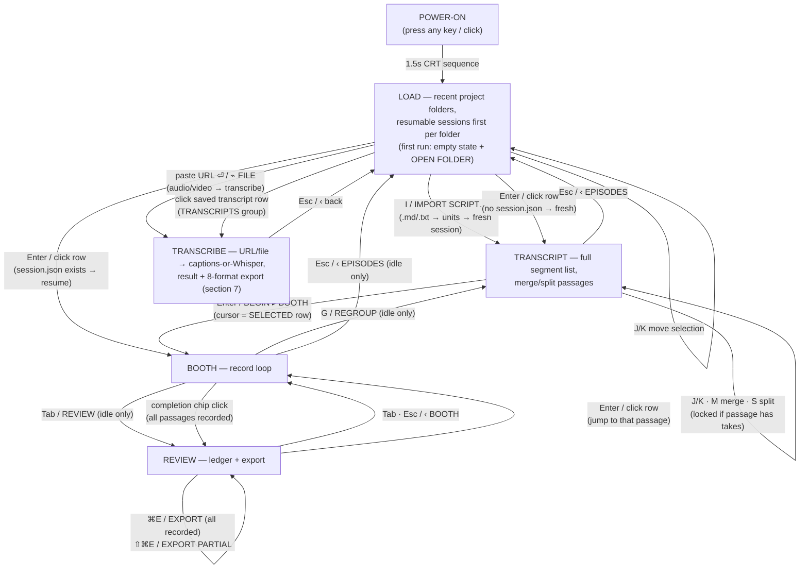
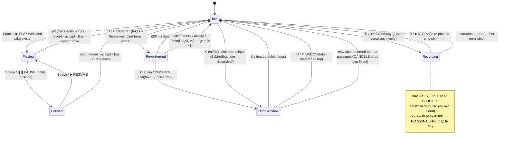
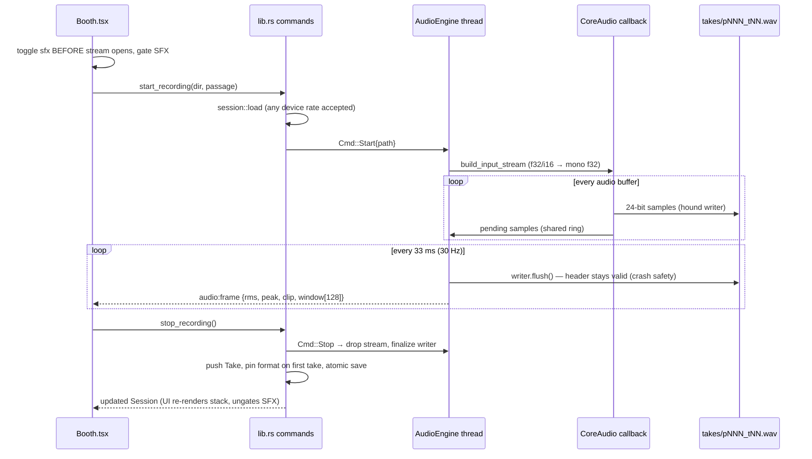
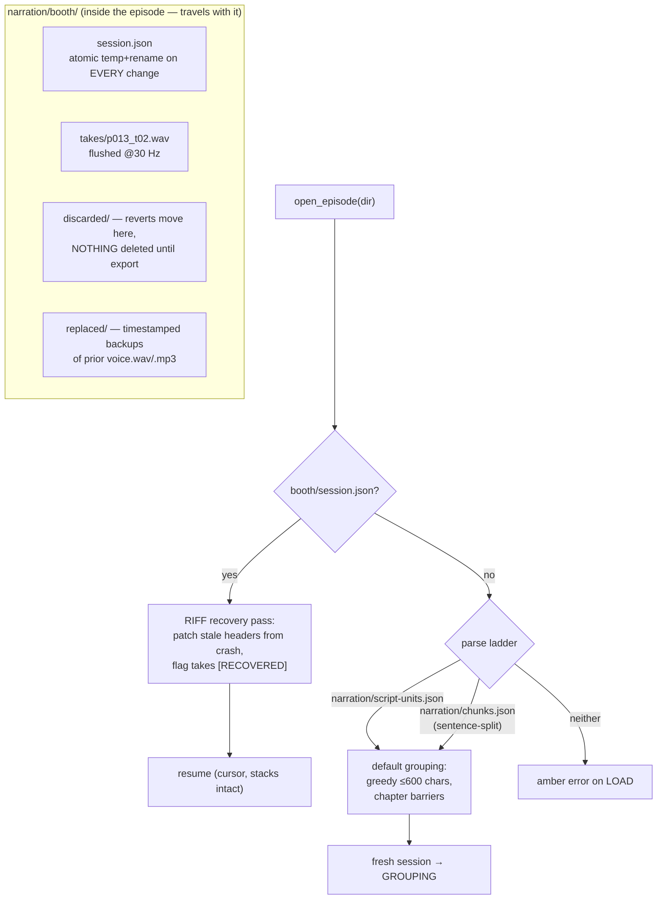
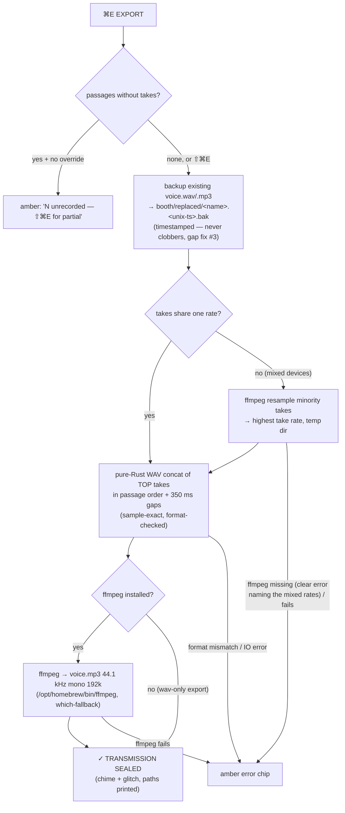
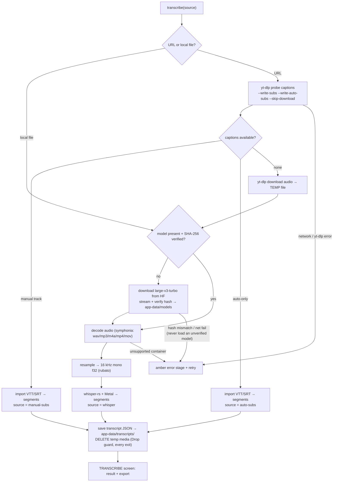
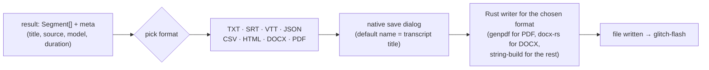

# BOOTH — design spec (living document)

**Mandatory reading before changing booth behavior.** Every screen, state, and side effect is
diagrammed here; if a change adds a transition, it MUST be added to the matching diagram first —
the missing-ESC bug existed precisely because exits were never enumerated. Keep diagrams and code
in lockstep.

Aesthetic + motion law come from the workspace brains: cyan `#7FE0FF` on `#0A0E14`, IBM Plex Mono,
animations are perfect seamless loops OR single-pass→settle (VIDEO-BRAIN §1). No scanlines
(founder, 2026-06-12).

---

## 1. Screen navigation

Every node lists every exit. Buttons and keys are the same transitions (buttons carry key hints).



**Contract:** LOAD rescans on every entry. BOOTH blocks ALL navigation while recording (the only
live exit is STOP). REVIEW row-jump sets `session.cursor` before switching. Cmd+Q (native) is
always available; a quit mid-take is recovered on next launch (diagram 4).

**Project model (replaced the hardcoded episodes root, 2026-06-12):** LOAD lists sessions found
under the user's **recent project folders** (persisted as `config.json` in the OS app-config dir,
newest first, capped at 8 — `src-tauri/src/config.rs`). A project folder is either a single
script's folder or a folder whose immediate subfolders are episodes; `session::scan` checks the
root itself plus one level down, and `session::list_candidates` lists fresh openables (folders
with a parseable `narration/` script but no session). Asset-protocol access for take playback is
granted **per opened folder at runtime** (`asset_protocol_scope().allow_directory`) — the static
scope in `tauri.conf.json` is empty by design.

**Script import (.md/.txt):** `import_script` parses the document
(`script::units_from_document` — blank-line paragraphs sentence-split into units; markdown
headings become chapters, fenced code skipped, light inline strip; a `[VISUAL:`/`[CUE:`
paragraph becomes the preceding unit's cue) and persists the result as the folder's
`narration/script-units.json`, so the standard parse ladder and every downstream feature work
unchanged. `session.sourceFile` links back to the imported document for inline-edit write-back.
Re-importing into a folder that already has a session is refused (open or remove the session
first). Unsupported extensions are rejected naming .md/.txt.

## 2. Booth interaction states



**Contract:** `revertArmed` and the undo window are per-passage intents — ANY action that changes
context (navigate, record, accept, leave screen) disarms/cancels them. Undo never reorders a
stack that has changed since the revert.

**Per-take delete (✕, founder 2026-06-12):** every take card carries a ✕ that fires on a SINGLE
click — no confirm; the 5 s undo window is the safety net (founder's call). Disk semantics are
identical to revert — the file MOVES to `discarded/`, never deleted. Deleting the top take clears
`accepted` (same as revert); deleting a lower take leaves the accepted top take alone. Caveat:
undoing a mid-stack delete restores the take to the TOP of the stack, not its original position.

**Control bar width is constant:** the ↶ UNDO button renders next to the amber TAKE DISCARDED
status line, NOT in the control bar — a conditional button in the bar widened it past the window
edge and clipped REVIEW (gap #13).

## 3. Recording data flow



**Contract:** the webview NEVER touches the mic. A UI crash/reload loses at most 33 ms of header
freshness, never samples. Mixed sample rates within a session are ALLOWED (rate gate removed,
founder 2026-06-12) — each take's WAV carries its own rate; export normalizes before concat
(diagram 5). `session.format` is informational only: it tracks the LATEST take for the top rail.

## 4. Session & disk lifecycle



**Contract:** Rust is stateless between commands (load→mutate→save); a crash can lose at most the
operation in flight. Take filenames scan BOTH takes/ and discarded/ for the next number — a
discarded `p001_t02` is never reused.

## 5. Export pipeline



**Contract:** export reads top-of-stack only; discarded takes never ship. Output satisfies the
pipeline contract consumed by `tools/align.sh` and `tools/sync-to-vo.py` unchanged.

## 6. session.json schema

```mermaid
classDiagram
    class Session {
        schema: 1
        episode: string
        source: "script-units.json" | "chunks.json"
        format: AudioFormat | null  // latest take's format (display only)
        units: ScriptUnit[]         // snapshot; text editable in-booth —
                                    // edits propagate to script-units.json
                                    // + the linked sourceFile document
        passages: Passage[]
        cursor: number
        createdAt: ISO string
        device: string | null
        sourceFile: string | null   // imported document (write-back target;
                                    // absent on pre-project-model sessions)
    }
    class Passage {
        unitStart: number  // inclusive
        unitEnd: number    // inclusive, contiguous coverage
        takes: Take[]      // newest last
        accepted: boolean
        selected?: number  // kept-take index; unset/oob = newest
    }
    class Take {
        file: string       // pNNN_tNN.wav
        durationSec: number // original full length (never mutated)
        recovered?: true
        cuts?: Cut[]       // non-destructive spans to REMOVE (edges + interior)
    }
    class Cut {
        startSec: number
        endSec: number
    }
    class AudioFormat {
        sampleRate: number
        channels: 1
        bits: 24
    }
    class ScriptUnit {
        text: string
        cue: string      // amber [VISUAL] footnote
        chapter: string
    }
    Session "1" --> "*" Passage
    Session "1" --> "*" ScriptUnit
    Session --> AudioFormat
    Passage "1" --> "*" Take
    Take "1" --> "*" Cut
```

**Invariants:** passages tile `units` contiguously (no gaps/overlaps); merge/split are only legal
on take-less passages; `cursor` is always clamped to a valid index.

## 7. Transcription (URL / file → transcript)

A **local, personal** transcription service folded into the booth: paste a URL
(YouTube / TikTok / IG / FB) or pick a local file (mp3/wav/m4a/mp4/mov). For URLs
the existing caption track is imported when present (cheap, no compute); otherwise
audio is transcribed with Whisper (`large-v3-turbo`, Metal). **Downloaded media is
transient and always deleted; output is transcript text only** (no media export,
no hosted service) — deliberately outside the stream-ripping risk zone.



**Contract:** the caption-skip path runs no Whisper and needs no ffmpeg — it is the
common path on YouTube; TikTok/IG/FB usually fall through to the Whisper path
(their caption tracks are unreliable/absent). The 1.6 GB `WhisperContext` loads
once on a dedicated worker thread (mirrors `AudioEngine`) and stays resident;
progress streams over `transcribe:progress` / `model:progress` like
`export:progress`. Temp media is removed on every exit, success or failure.



**Contract:** one unified `Segment {startMs, endMs, text, source}` feeds the saved
library JSON and every exporter (captions and Whisper produce the same shape). The
saved transcript is re-openable from the LOAD **TRANSCRIPTS** group. SRT uses
`HH:MM:SS,mmm`; VTT uses `HH:MM:SS.mmm`; no text is ever cropped or ellipsized.

---

## GAP AUDIT (iteration 2 — found by drawing the diagrams above)

| # | Gap (how the diagram exposed it) | Severity | Fix |
|---|---|---|---|
| 0 | No back/ESC from Grouping or Booth (screen FSM had one-way edges) | UX-blocking | ESC paths added (prev. hotfix), now in diagram 1 |
| 1 | `revertArmed` survives passage navigation → second R discards the WRONG passage's take (state diagram had no disarm edges) | **data loss** | disarm on nav / record / accept / Esc |
| 2 | Undo window survives a new recording → undone take lands ON TOP of the newer take (UndoWindow had no cancel edge) | wrong kept take | cancel undo when a new take is recorded on that passage |
| 3 | Second export renames over `replaced/voice.mp3.bak` → destroys the original backup (export diagram, backup node) | **data loss** | timestamped backup names `<name>.<unix-ts>.bak` |
| 4 | Dead-mic recording writes silence with no warning (sequence diagram, frame loop) | silent failure | NO SIGNAL chip after 2 s of peak < 0.001 |
| 5 | Review ledger: no keyboard scroll, rows not actionable | UX | J/K selection + Enter/click jumps to passage in Booth |
| 6 | LOAD list scanned once per app launch | UX | rescan on entry + RESCAN button |
| 7 | Nothing tells you when every passage is recorded | UX | green completion chip → Review |
| 8 | Teleprompter "— end of script —" branch unreachable (cursor clamped) | dead code | removed |
| 9 | Keyboard-only controls — nothing visibly clickable | founder directive | Btn layer on every screen (this iteration) |
| 10 | Teleprompter long passages overflow — text slides under the top rail and clips the amber cue line (fixed 26px font + `overflow: hidden` centering assumed short passages) | cue unreadable | font auto-scales 26→18px with passage length; margin-auto overflow-safe centering + scroll; ghost lines hidden >420 chars; cue line `flexShrink: 0` |
| 11 | Only the TOP take is discardable (R-R) — a bad middle take is stuck in the stack | founder directive | ✕ per take card, single click (5 s undo is the net), `discard_at` moves any take to `discarded/` (diagram 2) |
| 12 | REC button's circle ring | founder directive (cosmetic) | ring removed — bare glyph + label, live pulse moved to the glyph glow |
| 13 | Conditional ↶ UNDO button widened the control bar past the window edge — REVIEW clipped while the undo window was open | UX | UNDO moved next to the amber TAKE DISCARDED status line; control bar width never changes |
| 14 | Sample-rate pin blocked recording when the input device changed (AirPods 24 kHz session vs built-in 48 kHz) — even on an empty session | founder directive | gate removed; export resamples minority-rate takes to the highest take rate via ffmpeg before concat (diagram 5 NORM/RS); uniform sessions keep the pure sample-exact path |
| 15 | Transcript screen selection didn't carry into the booth — select row 1, BEGIN, land on the OLD cursor's passage (sel was local state, never written to `session.cursor`) | wrong passage | `begin()` saves `cursor = sel` before switching screens |
| 16 | Script text was read-only in the booth — wording tweaks meant editing files by hand | founder directive | click the teleprompter text (idle only) → inline textarea, one paragraph per unit; SAVE button (greyed until the draft changes) + always-active CANCEL, or ⌘S; propagates each changed unit to session.json, `script-units.json`, and `completed-videos/<slug>/script.md` (exact-match replace; warnings on the amber chip if a target is missing); Esc/CANCEL discards immediately; click-outside exits silently when clean, but a dirty draft pops SAVE CHANGES? (Save ⏎ / Discard esc) — never a silent data loss |
| 17 | Control bar overflowed again when VIEW TRANSCRIPT widened it (fixed px button metrics assumed short labels + wide window) | REVIEW clipped | button metrics viewport-scaled via `clamp()` (`.btn`, `.control-bar`, REC); key hints hide below 1340 px (keys still work) |
| 18 | App was unusable off the author's machine — episodes root, asset scope, and the edit write-back sink were all hardcoded to one workspace | OSS-blocking | project model: recents + OPEN FOLDER (config.rs), runtime asset-scope grants, `session.sourceFile` write-back target (legacy completed-videos sink removed) |
| 19 | Only pre-built script-units.json / chunks.json could be opened — a stranger has a script in a document, not our JSON | OSS-blocking | IMPORT SCRIPT… (.md/.txt) on LOAD: `units_from_document` → persisted units file → normal session; cue convention preserved |
| 20 | Export hard-required ffmpeg (mp3 step) — strangers won't have it installed | OSS-blocking | ffmpeg is optional: WAV always exports (pure Rust); mp3 encodes when `ffmpeg_available()`; mixed-rate-without-ffmpeg fails with a clear error naming the rates; Review shows a NO FFMPEG chip before export |
| 21 | No in-app documentation — a stranger has to find the README to learn the keys | onboarding | `?` modal cheat-sheet on every screen (HelpOverlay; swallows all keys while open so reading help can't trigger a recording), KEY BINDINGS corner button (was a faint `?` dot) |
| 22 | Recording input was locked to the OS default device — switching mics meant a trip to Control Center | founder directive | the top-rail device label is a picker: any input or System default; persisted in config.json, falls back to default when the device disappears |
| 23 | Text kept regressing to the faint tier (TAKES, RECORDED, help footer…) — repeated founder corrections | readability rule | **`--faint-cyan` is for borders/fills ONLY, never text** (rule pinned at the top of booth.css); text floor is `--dim-cyan`, de-emphasis via opacity on top of dim |
| 24 | With >1 take you couldn't choose which one was kept — `topTake`/`.last()` hardcoded "newest = kept" across play, accept, and export; take rows weren't even clickable. And no way to trim dead air off a take. | founder directive | **Selectable takes:** `Passage.selected` index (unset = newest, resets on record/delete); clicking a take row makes it the kept take that plays/accepts/exports (`selected_take` in TS + Rust). **Inline non-destructive cuts (Audacity ripple):** the strip shows the selected take's EDITED timeline — click=cursor, drag=select, `Del`=cut; cut audio leaves the timeline (waveform closes the gap) and a thin break stub marks the splice (click a stub to restore that cut; `↩ RESTORE` reverts the take). Stored as `Take.cuts[]` in ORIGINAL seconds (the WAV is never modified); the editor maps original↔kept time for display. `Take::kept_spans` derives the complement; applied at playback (skip cuts) and export (`concat_wavs_segments`, sample-exact, survives resample). New `take_waveform` command feeds the static envelope. Editor interaction modeled on Audacity (gap #25). |
| 27 | Export always wrote a generic `narration/voice.wav` + `voice.mp3`, backing the prior one up as a timestamped `.bak` — every render lumped into one folder under one name, easy to lose / hard to tell apart. | founder directive | Export writes `<document>.wav` / `<document>.mp3` (from `session.episode`, sanitized) directly in the episode dir (next to the source), with ` (N)` dedup so a re-export never clobbers (`export_stem` + `dedup_base`). Replaces the `backup()`/`replaced/` scheme (gap #3). |
| 26 | Playing a take with cuts clicked and stuttered at every splice — playback seeked an `<audio>` element's `currentTime` at each cut (decoder restart → click) on the coarse ~4 Hz `timeupdate` event (visual stutter). | quality | `useTakePlayer` (Web Audio): decode the WAV once into an `AudioBuffer`, schedule the kept spans back-to-back via `AudioBufferSourceNode.start(when, offset, dur)` on the `AudioContext` clock (sample-accurate, gapless) with a ~6 ms GainNode edge ramp to kill the splice click; playhead read from the audio clock via rAF (smooth, mapped original→kept for display). Play now matches export. |
| 25 | Transport keys fought editor muscle memory — `Space` = Record / `P` = Play / `R·R` = Revert, the inverse of every audio editor, so reaching for Space-to-play armed a take instead. And the record cue bled into the head of each take (the SFX fired but the mic opened before it finished). | founder directive | **Audacity transport:** `Space` = Play/**Pause** (resumes in place; cursor/selection change resets), `R` = Record/Stop, `D·D` = Revert (double-tap). Waveform: click = cursor, drag = selection, `Del` = cut, `✕` = restore — modeled on Audacity. **Cue no longer bleeds:** `playSfx` resolves on end and the record path `await`s the cue before opening the mic. Help overlay / README / RecBtn / state diagram updated. |

| 28 | Secondary text was still too faint and, worse, the prior rule (#23) actively encouraged stacking `opacity` ON TOP of `--dim-cyan` — unrecorded Review rows hit ~0.29, inactive Grouping units ~0.34, deep TakeStack cards ~0.18. The founder reads it as faded. | readability rule | **No faded text.** `--dim-cyan` floor raised 0.45→0.72; new `--dim-cyan-soft` (0.58) is the de-emphasis tier. Every text token meets a legibility floor on `#0A0E14`; de-emphasis steps to the soft tier, NEVER by multiplying opacity below the floor. `--faint-cyan` stays borders/fills only. Disabled controls are the sole exemption. Compounding opacities removed from Review/Grouping/TakeStack/WaveformEditor + `.btn-hint`/`.take-delete`/`.device-label`. (Supersedes #23.) |

Future gaps: add the transition to the diagram FIRST, then implement, then append a row here.
